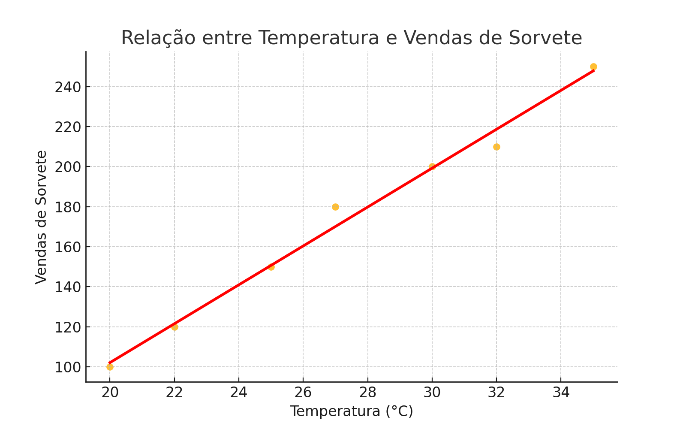

# Previsão de Vendas de Sorvete 🍦📊

Este projeto usa Machine Learning para prever vendas de sorvete com base na temperatura do dia, ajudando sorveterias a planejarem melhor sua produção.

## Objetivos
- Prever vendas com base na temperatura
- Utilizar regressão linear
- Registrar experimentos com MLflow
- (Opcional) Servir modelo via API Flask

## Como usar
1. Instale os requisitos:
```
pip install -r requirements.txt
```

2. Execute o treinamento e registre no MLflow:
```
python modelo_sorvete.py
mlflow ui
```

## Estrutura
- `inputs/dados.csv`: base de dados
- `modelo_sorvete.py`: script principal
- `README.md`: documentação

## Exemplo de dados
| Temperatura | Vendas |
|-------------|--------|
| 20°C        | 100    |
| 25°C        | 150    |
| 35°C        | 250    |

## Melhorias futuras
- Ajustar hiperparâmetros
- Usar modelos mais complexos (árvores, ensembles)
- Criar dashboard de previsão em tempo real


## Gráfico de Regressão


## API para Previsão em Tempo Real
Você pode usar uma API Flask para fazer previsões usando o modelo treinado:

### Exemplo de código (`api.py`)
```python
from flask import Flask, request, jsonify
import mlflow.sklearn

app = Flask(__name__)
model = mlflow.sklearn.load_model("mlruns/0/<ID_DO_RUN>/artifacts/modelo_sorvete")  # Substitua <ID_DO_RUN>

@app.route('/predict', methods=['POST'])
def predict():
    data = request.get_json()
    temperatura = data['temperatura']
    prediction = model.predict([[temperatura]])
    return jsonify({'temperatura': temperatura, 'vendas_previstas': prediction[0]})

if __name__ == '__main__':
    app.run(debug=True)
```

### Exemplo de requisição
```bash
curl -X POST http://127.0.0.1:5000/predict -H "Content-Type: application/json" -d '{"temperatura": 30}'
```
